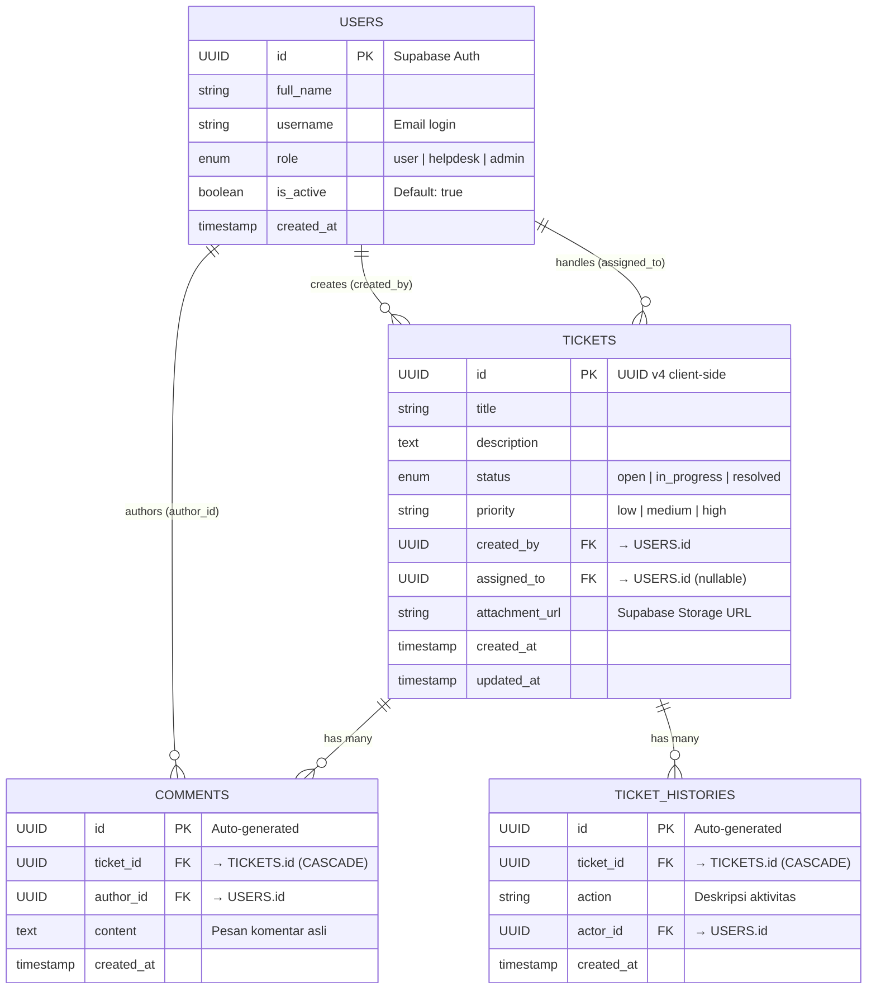
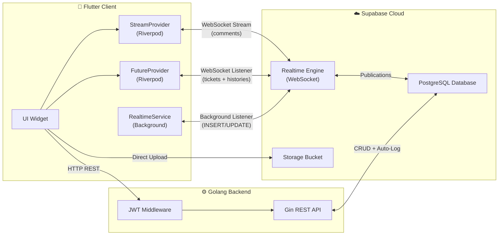
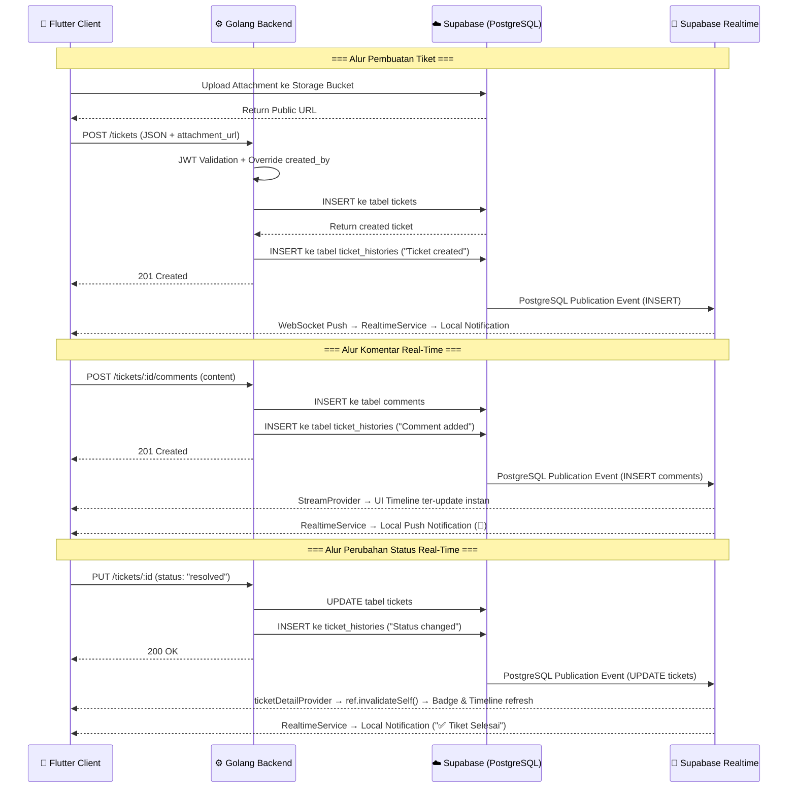

# Dokumentasi Sistem (Analisa ERD Engine & Arsitektur Real-Time)

Sistem **E-Ticketing Helpdesk & IT Support** didukung oleh arsitektur backend terdistribusi yang telah berevolusi menjadi **Real-Time Event-Driven Architecture**. Otentikasi, penyimpanan *blob/object*, dan **sinkronisasi data real-time** (WebSocket) dikelola oleh **Supabase (PostgreSQL + Realtime Publications)**, sementara validasi *core data* tiket dan *business logic* diurus oleh **Golang Backend REST API**.

---

## 1. Entity Relationship Diagram (ERD)

Berdasarkan struktur model data pada lapisan *Domain* Flutter dan skema tabel PostgreSQL di Supabase, sistem memiliki **empat entitas utama** yang saling berelasi.

### 1.1 Entitas `Users` (Profiles)

Digunakan untuk manajemen hak akses dan identitas pengguna. Tersimpan di database Supabase (`auth.users` sebagai sumber otentikasi dan `public.profiles` sebagai tabel sekunder untuk data aplikasi).

| Field Name  | Data Type    | Keterangan |
| :---------- | :----------- | :--------- |
| `id`        | UUID (PK)    | Di-generate oleh Supabase Auth, primary key. |
| `full_name` | String       | Nama lengkap pengguna. |
| `username`  | String       | Email untuk login (unik). |
| `role`      | Enum         | Peran: `user`, `helpdesk`, atau `admin`. |
| `is_active` | Boolean      | Status akun aktif/nonaktif. Default `true`. |
| `created_at`| Timestamp    | Waktu akun dibuat. |

### 1.2 Entitas `Tickets`

Data utama pengaduan yang divalidasi dan dikirim melalui backend Golang, lalu disimpan ke Supabase PostgreSQL.

| Field Name      | Data Type     | Keterangan |
| :-------------- | :------------ | :--------- |
| `id`            | UUID v4 (PK)  | Dibuat oleh *client* (Flutter) menggunakan package `uuid`. |
| `title`         | String        | Judul keluhan atau masalah. |
| `description`   | Text          | Detail penjelasan keluhan. |
| `status`        | Enum          | Status: `open`, `in_progress`, atau `resolved`. |
| `priority`      | String        | Prioritas: `low`, `medium`, `high`. |
| `created_by`    | String (FK)   | ID pelapor (relasi ke `Users`). |
| `assigned_to`   | String (FK)   | ID teknisi yang ditunjuk (relasi ke `Users`, nullable). |
| `attachment_url` | String       | Path URL file di Supabase Storage (opsional, mendukung gambar & PDF). |
| `created_at`    | Timestamp     | Waktu tiket dibuat. |
| `updated_at`    | Timestamp     | Waktu terakhir tiket diperbarui. |

### 1.3 Entitas `Comments` *(BARU)*

Tabel percakapan/komunikasi antara pelapor dan teknisi di dalam konteks sebuah tiket. Berelasi *Many-to-One* terhadap `Tickets` (via `ticket_id`) dan `Users` (via `author_id`).

| Field Name  | Data Type    | Keterangan |
| :---------- | :----------- | :--------- |
| `id`        | UUID (PK)    | ID komentar, auto-generated oleh PostgreSQL. |
| `ticket_id` | UUID (FK)    | Merujuk ke entitas `Tickets` (ON DELETE CASCADE). |
| `author_id` | UUID (FK)    | Merujuk ke entitas `Users` sebagai pengirim pesan. |
| `content`   | Text         | Isi pesan komentar asli yang dikirimkan pengguna. |
| `created_at`| Timestamp    | Waktu komentar dibuat. |

### 1.4 Entitas `TicketHistories` (Catatan Histori / Audit Trail)

Berfungsi sebagai jejak aktivitas (*audit trail*) dari setiap perubahan status dan penugasan pada sebuah tiket. Relasinya adalah *One-to-Many* (Satu Tiket memiliki Banyak History).

| Field Name  | Data Type    | Keterangan |
| :---------- | :----------- | :--------- |
| `id`        | UUID (PK)    | ID log timeline. |
| `ticket_id` | UUID (FK)    | Merujuk ke entitas `Tickets` (ON DELETE CASCADE). |
| `action`    | String       | Deskripsi aktivitas (misal: "Status changed from 'open' to 'in_progress'"). |
| `actor_id`  | UUID (FK)    | ID pengguna yang melakukan aksi. |
| `created_at`| Timestamp    | Waktu aktivitas dilakukan. |

---

## 2. Keamanan Database: Row Level Security (RLS)

Selain proteksi RBAC di sisi aplikasi (Flutter) dan middleware (Golang), database Supabase juga dilindungi oleh **Row Level Security (RLS)** pada level PostgreSQL untuk mencegah akses data langsung yang tidak sah melalui klien Supabase SDK.

### Kebijakan RLS pada Tabel `comments`

| Policy Name | Operation | Target Role | Deskripsi |
| :---------- | :-------- | :---------- | :-------- |
| `Enable read access for all users` | `SELECT` | `authenticated` | Semua pengguna yang telah login dapat membaca komentar pada tiket manapun (untuk menampilkan timeline tracking). |
| `Enable insert for authenticated users only` | `INSERT` | `authenticated` | Hanya pengguna yang telah terotentikasi yang dapat menambahkan komentar baru. |

### Kebijakan RLS pada Tabel Lain

Tabel `tickets` dan `ticket_histories` juga telah diaktifkan Realtime Publications-nya melalui dashboard Supabase (**Database > Replication > Tables**), namun kontrol akses utamanya dipegang oleh **JWT Auth Middleware** pada Golang Backend.

---

## 3. Arsitektur Real-Time Event-Driven

Sistem telah bertransisi dari arsitektur **Future/REST API statis** (request-response murni) menjadi **Real-Time Event-Driven Architecture** yang memanfaatkan **Supabase Realtime Publications** berbasis protokol WebSocket.

### 3.1 Tabel yang Diaktifkan Realtime Publications

| Tabel | Event yang Didengarkan | Consumer di Flutter |
| :---- | :--------------------- | :------------------ |
| `comments` | `INSERT` | `ticketCommentsRealtimeProvider` (StreamProvider) — memperbarui timeline komentar secara instan. |
| `tickets` | `UPDATE` | `ticketDetailProvider` (FutureProvider + Listener) — memperbarui badge status & data tiket. |
| `ticket_histories` | `INSERT` | `ticketDetailProvider` (FutureProvider + Listener) — memperbarui log riwayat di timeline. |
| `tickets` | `ALL` | `RealtimeService` (Background) — memicu notifikasi push lokal & pembaruan daftar tiket. |

### 3.2 Mekanisme Sinkronisasi

1. **`StreamProvider` untuk Komentar:** Tabel `comments` di-*stream* secara langsung menggunakan `Supabase.instance.client.from('comments').stream(primaryKey: ['id'])`. Setiap INSERT baru langsung dipancarkan ke UI tanpa perlu polling.

2. **`ref.invalidateSelf()` untuk Status & Riwayat:** Di dalam `ticketDetailProvider`, dua *listener* Supabase Realtime diaktifkan:
   - Listener `UPDATE` pada tabel `tickets` → memanggil `ref.invalidateSelf()` jika `payload.newRecord['id']` cocok.
   - Listener `INSERT` pada tabel `ticket_histories` → memanggil `ref.invalidateSelf()` jika `payload.newRecord['ticket_id']` cocok.

3. **`RefreshIndicator` sebagai Fallback:** Widget `RefreshIndicator` membungkus `SingleChildScrollView` pada halaman detail tiket. Jika koneksi WebSocket terputus (sinyal buruk), pengguna dapat menarik layar ke bawah (*Pull-to-Refresh*) untuk memaksa pemanggilan `ref.refresh(ticketDetailProvider(ticketId).future)`.

4. **`ref.onDispose()` untuk Kebersihan Memori:** Setiap *channel* Realtime yang dibuka oleh `ticketDetailProvider` akan secara otomatis di-*unsubscribe* saat provider tidak lagi digunakan (halaman ditutup), mencegah *memory leak*.

---

## 4. Flow Data & Integrasi Engine (Diperbarui)

1. **User Sign Up/Login**: Klien mengirim *credentials* ke Supabase Auth. Supabase merespons dengan Session Token (JWT) yang digunakan untuk mengotorisasi setiap request ke Golang Backend.
2. **Kirim Tiket & Attachment**: Jika ada lampiran (gambar/PDF), Flutter mengunggahnya langsung ke **Supabase Storage Bucket**. URL yang dihasilkan diteruskan bersama data JSON Tiket ke **Golang Backend** via *HTTP POST*.
3. **Auto-Logging oleh Backend**: Golang API secara otomatis mencatat setiap perubahan status dan penugasan ke tabel `ticket_histories` (BR-005: Tracking).
4. **Real-Time Propagation**: Setelah Golang menulis ke Supabase, **Realtime Engine** secara otomatis memancarkan (*broadcast*) event perubahan melalui WebSocket ke seluruh klien Flutter yang sedang mendengarkan.
5. **Data Retrieval & RBAC Filtering**: Flutter mengambil daftar tiket via HTTP GET ke Golang API yang menerapkan **RBAC filtering** langsung di level query database berdasarkan role JWT pengguna.
