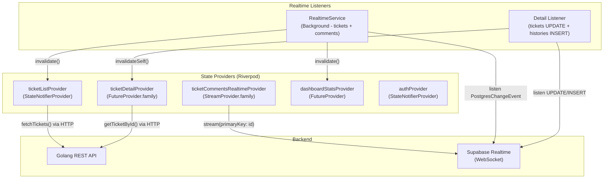
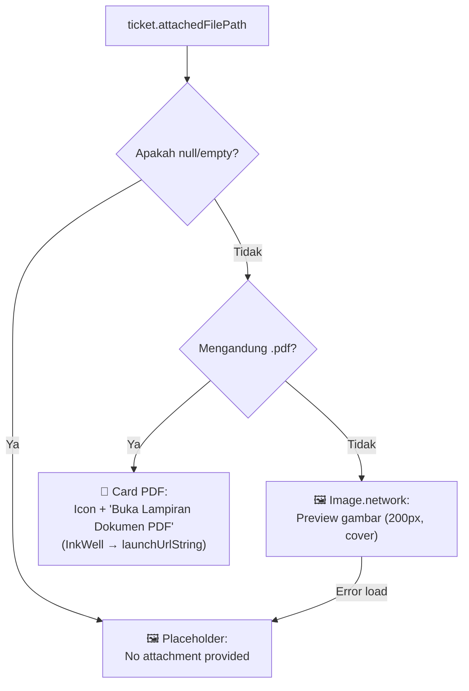

# Dokumentasi Coding (Penjelasan Function & Arsitektur Kode)

Aplikasi Flutter ini dibangun menggunakan pendekatan **Clean Architecture - Feature-First Lite** yang mengisolasi kode per fitur (`auth`, `ticket`, `dashboard`, `notification`). Setiap fitur dibagi ke tiga lapis: **Presentation (UI & State)**, **Domain (Model & Entity)**, dan **Data (Repository & Service)**.

---

## 1. Pengelolaan State Management (Riverpod + Supabase Realtime)

Proyek ini mengandalkan `flutter_riverpod` untuk menangani *State* dan *Dependency Injection*. Sejak **refactoring v3.0.0**, arsitektur state telah bertransisi dari **Future/REST murni** menjadi **Hybrid Real-Time** yang menggabungkan `FutureProvider`, `StreamProvider`, dan `StateNotifierProvider` dengan *listener* Supabase Realtime.



### 1.1 `auth_provider.dart` & `AuthRepository`
*   **Fungsi `login(email, password)`**: Mengirim *request* otentikasi ke Supabase Auth. Jika berhasil, objek `UserModel` (menampung nama, ID, dan *role*) diemisikan ke dalam *State*.
*   **Fungsi `restoreSession()`**: Berjalan saat splash screen pertama dibuka. Mengambil token *cache* (Supabase Auth State) untuk melompati halaman login jika sesi masih aktif.
*   **Fungsi `logout()`**: Menghapus sesi di Supabase dan SharedPreferences, mereset state AuthProvider, dan menghentikan `RealtimeService`.

### 1.2 `ticket_provider.dart` & `TicketRepository`
*   **`ticketListProvider` (StateNotifierProvider)**:
    *   **`fetchTickets()`**: Menggunakan *Dio* untuk memanggil endpoint `GET /tickets` pada Golang API. Mengonversi JSON `List<dynamic>` menjadi `List<TicketModel>` dengan mekanisme *loading/error state* dari `AsyncValue`.
    *   **`handleRealtimeEvent()`**: Menerima *payload* dari `RealtimeService` dan memperbarui *state* lokal secara reaktif (INSERT = tambah ke list, UPDATE = perbarui field, DELETE = hapus dari list).

*   **`ticketDetailProvider` (FutureProvider.family + Realtime Listener)**:
    *   Mengambil detail tiket via `repo.getTicketById(id)` dan riwayat via `repo.getTicketHistories(id)`.
    *   **Realtime Listener Internal**: Saat provider diinisialisasi, dua *listener* Supabase Realtime diaktifkan:
        - `PostgresChangeEvent.update` pada tabel `tickets` → `ref.invalidateSelf()` jika ID cocok.
        - `PostgresChangeEvent.insert` pada tabel `ticket_histories` → `ref.invalidateSelf()` jika `ticket_id` cocok.
    *   **`ref.onDispose()`**: Secara otomatis melakukan *unsubscribe* dari *channel* saat halaman detail ditutup (mencegah *memory leak*).
    *   **Filter Bot Messages**: Log generik `"Comment added"` dari `ticket_histories` difilter menggunakan `if (h.action.toLowerCase().contains('comment added')) continue;` agar tidak mengotori tampilan timeline.

*   **`ticketCommentsRealtimeProvider` (StreamProvider.family)**:
    *   Terhubung langsung ke Supabase Realtime menggunakan:
        ```dart
        Supabase.instance.client
          .from('comments')
          .stream(primaryKey: ['id'])
          .eq('ticket_id', ticketId)
        ```
    *   Setiap `INSERT` baru pada tabel `comments` langsung dipancarkan ke UI dalam hitungan milidetik tanpa polling.

*   **`addComment(ticketId, content)`**: Mengirim POST ke Golang API (`/tickets/:id/comments`). Setelah berhasil, memanggil `ref.invalidate(ticketCommentsRealtimeProvider(ticketId))` sebagai *force-refresh* cadangan.

### 1.3 `realtime_service.dart` (Global Background Service)

Service *singleton* yang berjalan di background selama aplikasi aktif. Mendengarkan **dua tabel** secara simultan pada satu *channel* Supabase:

| Tabel | Event | Aksi |
| :---- | :---- | :--- |
| `tickets` | `ALL` (INSERT/UPDATE/DELETE) | Memperbarui `ticketListProvider`, `dashboardStatsProvider`, dan memicu *local push notification*. |
| `comments` | `INSERT` | Memicu *local push notification* dengan konten komentar asli. |

**Fitur Keamanan pada Notifikasi:**
*   **Anti-Spam**: Tidak membunyikan notifikasi untuk komentar yang dikirim oleh diri sendiri (`currentUserId == authorId`).
*   **RBAC Proteksi Helpdesk**: Untuk role `helpdesk`, notifikasi hanya akan terkirim jika tiket terkait sudah di-assign kepada pengguna tersebut.
*   **Resolusi Nama Dinamis**: Nama pengirim diambil secara real-time dari tabel `users`/`profiles` untuk ditampilkan pada notifikasi.

**Logika Kondisional Notifikasi:**
```dart
// Status resolved → judul: "✅ Tiket Selesai"
// Status berubah  → judul: "🔄 Status Update"
// Assigned berubah → judul: "👤 Ticket Assigned"
// Komentar baru   → judul: "💬 Komentar Baru pada Tiket #XXXXXXXX"
```

### 1.4 Image Upload Logic (`ImagePicker` & Supabase Storage)
*   **Fungsi `pickImage()`**: Memanggil library `image_picker` (sumber: galeri/kamera) untuk mengambil file *byte stream*.
*   **Fungsi `uploadAttachment(File file)`**: Menggunakan UUID v4 sebagai prefix nama file untuk mencegah kolisi:
    ```dart
    final String fileName = '${const Uuid().v4()}_${file.path.split('/').last}';
    ```

### 1.5 Routing dengan `GoRouter`
Navigasi dikelola oleh `go_router` menggunakan deklarasi *path* (misal `/login`, `/dashboard`, `/ticket/:id`).
*   **Redirect Logic (Guard)**: Terdapat *router guard* yang memantau *auth state*. Jika state bernilai `null` (belum login) tapi pengguna mencoba membuka `/dashboard`, aplikasi otomatis mem-*force redirect* ke `/login`.

---

## 2. Conditional Rendering & Logika Filter ITIL

### 2.1 Tombol Aksi Kontekstual (Bukan Manual Dialog)

Sistem telah meninggalkan pendekatan dialog "Update Status" manual dan beralih ke **tombol aksi kontekstual** yang muncul berdasarkan status tiket saat ini:

| Status Tiket | Tombol yang Muncul | Role yang Bisa Melihat |
| :----------- | :----------------- | :--------------------- |
| `open` | **"Assign Staff"** | Admin |
| `in_progress` | **"Resolve Ticket"** | Admin, Helpdesk (yang di-assign) |
| `resolved` | *Tidak ada tombol* — muncul banner hijau "This ticket has been resolved" | Semua role |

### 2.2 Hierarki Filter Daftar Tiket

| Role | Filter yang Diterapkan |
| :--- | :--------------------- |
| **User** | Hanya tiket `created_by == user.id` |
| **Helpdesk** | Hanya tiket `assigned_to == user.id` |
| **Admin** | Semua tiket tanpa filter |

### 2.3 Conditional FAB (Floating Action Button)
```dart
// Di ticket_list_screen.dart — FAB hanya untuk role User
floatingActionButton: user?.role == UserRole.user ? FloatingActionButton(...) : null,
```

---

## 3. Dynamic Role Masking & Label

### 3.1 Penyamaran UUID pada Timeline
Fungsi `_cleanDescription()` menyensor UUID staf yang muncul di log riwayat penugasan:
```dart
String _cleanDescription(String desc) {
  if (desc.contains('Ticket assigned to')) {
    return 'Ticket assigned to Helpdesk Technician';
  }
  return desc;
}
```

### 3.2 Pelabelan Role Dinamis
Fungsi `_getFriendlyRole()` menerjemahkan kode role internal menjadi label *human-readable* yang sopan:

| Role Internal | Label Tampilan |
| :------------ | :------------- |
| `ADMIN` | System Administrator |
| `STAFF` / `HELPDESK` | Technical Support |
| `SYSTEM` | System |
| *(lainnya)* | Reporter |

---

## 4. Penanganan Lampiran Multi-Format

Widget penampil lampiran pada halaman detail tiket kini mendukung dua tipe file:



*   **File Gambar** (`.jpg`, `.png`, `.webp`): Ditampilkan sebagai preview menggunakan `Image.network` dengan `ClipRRect` untuk sudut membulat.
*   **File PDF** (`.pdf`): Ditampilkan sebagai `Container` interaktif berdesain Material 3 dengan ikon `picture_as_pdf` berwarna merah. Ketika ditekan, memanggil `launchUrlString()` dari package `url_launcher` untuk membuka PDF di browser/viewer bawaan perangkat.
