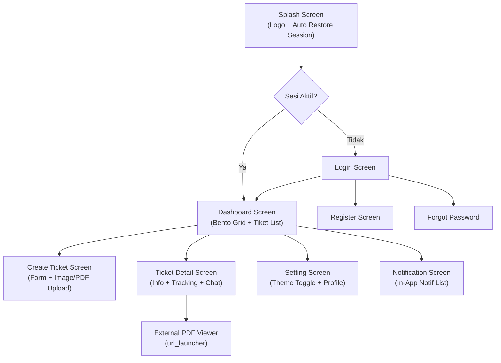

# Dokumentasi Frontend UI/UX (Desain Sistem & Interaksi)

Aplikasi dibangun dengan mengutamakan performa fungsi sekaligus estetika modern berbasis pedoman **Material Design 3 (M3)** dari Google yang dimodifikasi untuk menciptakan pengalaman *premium-grade*.

---

## 1. Konsep Desain Utama

### 1.1 Glassmorphism (Efek Kaca Buram)
Beberapa kartu (*Card*), *Header*, dan dialog menggunakan efek *blur* translusen (`BackdropFilter` pada Flutter) dipadukan dengan opasitas warna semi-transparan. Efek ini memberikan kedalaman spasial (*depth*) yang mewah dan rasa aplikasi premium iOS/macOS.

### 1.2 Bento Grid Layout
Pada halaman Dashboard (terutama untuk Admin/Helpdesk), metrik dan statistik disajikan dalam format **Bento Grid**—berupa blok-blok asimetris membulat (rounded box) yang menyesuaikan dengan luas kontainer (responsif). Format ini sangat ramah mata dan membantu hierarki informasi.

### 1.3 Warna & Tipografi
*   **Font Family:** Menggunakan font dari package `google_fonts` (misalnya Inter atau Poppins) yang memberikan keterbacaan tinggi di ukuran layar kecil.
*   **Color Scheme:** Mengandalkan `ColorScheme.fromSeed` atau warna kustom *dark/light mode* harmonis, dengan penggunaan konsisten `Theme.of(context).colorScheme` di seluruh codebase untuk menjamin adaptasi sempurna terhadap kedua mode tema.
*   **Dark/Light Mode**: Tema default adalah **Light Mode** saat pertama kali diinstal. Toggle tema tersimpan secara persisten di `SharedPreferences` dan sinkron 100% dalam sekali klik melalui `ThemeProvider` berbasis Riverpod.

### 1.4 Lucide Icons
Memanfaatkan paket `lucide_icons` yang bersudut lengkung dan elegan, menghindari ikon-ikon kaku bawaan *Material Icons* klasik. Ikon `Icons.picture_as_pdf` dari Material tetap digunakan khusus untuk penanda lampiran PDF.

---

## 2. Hirarki Halaman (Screen Flow)

### 2.1 Splash & Auth Screens
*   **Splash Screen:** Menampilkan logo aplikasi kustom (`Image.asset('assets/logo/logo_app.png')`) dengan proporsi 120–150px di tengah layar, disertai teks "Helpdesk Ticketing" di bawahnya.
*   **Login / Register Page:** Memuat gambar *header banner* lokal (`assets/logindeadline.jpg` dan `assets/registerbp.jpeg`). Menggunakan *TextFormField* melengkung (`OutlineInputBorder` radius 16px).

### 2.2 Main Dashboard
Tampilan dashboard dibedakan berdasarkan role:

| Role | Komponen UI Utama |
| :--- | :---------------- |
| **User** | Banner besar "Create New Ticket" + pelacakan tiket pribadi |
| **Helpdesk** | Metrik *Bento* "Assigned to Me" + list tiket prioritas tinggi |
| **Admin** | Visualisasi analitik penuh (Bento Grid Global) + shortcut "Manage Users" |

### 2.3 Detail Ticket Screen
*   **Header Section:** Menampilkan Judul, Badge Status (berwarna-warni: Hijau untuk *Resolved*, Orange untuk *In Progress*, Biru untuk *Open*), Nama Pelapor, dan label Assigned Staff.
*   **Attachment Card (Multi-Format):**
    - **Gambar**: Pratinjau *thumbnail* menggunakan *Rounded Image Loader*.
    - **PDF**: Card merah interaktif dengan ikon `picture_as_pdf` dan teks "Buka Lampiran Dokumen PDF" yang membuka file di viewer eksternal.
    - **Kosong**: Placeholder abu-abu dengan ikon `imageOff` dan teks *italic* "No attachment provided".
*   **Activity Timeline Stepper:** Komponen khusus (custom widget) berupa garis vertikal dengan titik-titik bulatan (*nodes*) yang menghubungkan setiap tahap penyelesaian. Mencakup:
    - Log riwayat sistem (pembuatan tiket, perubahan status, penugasan staf)
    - Komentar asli pengguna (real-time via StreamProvider)
    - Label role dinamis: *System Administrator*, *Technical Support*, *Reporter*
    - Timestamp yang selalu menggunakan waktu lokal perangkat (`.toLocal()`)
*   **Sticky Action Area:** Tombol kontekstual di bagian bawah layar:
    - `open` → "Assign Staff" (Admin only)
    - `in_progress` → "Resolve Ticket" (Admin/Helpdesk)
    - `resolved` → Banner hijau "This ticket has been resolved"
*   **Pull-to-Refresh:** `RefreshIndicator` membungkus seluruh area konten dengan `AlwaysScrollableScrollPhysics` untuk memaksa sinkronisasi manual.

### 2.4 Notification Screen
Menampilkan daftar notifikasi in-app yang dikumpulkan oleh `RealtimeService` secara kronologis. Setiap item menampilkan judul, pesan, dan timestamp relatif.

---

## 3. Micro-Interactions & Animasi

| Komponen | Interaksi |
| :------- | :-------- |
| Tombol aksi (`ElevatedButton`, `IconButton`) | *InkWell ripple* effect pada sentuhan |
| Card lampiran PDF | *InkWell* dengan `borderRadius` untuk efek sentuh membulat |
| Badge status tiket | Warna latar dan border dinamis berdasarkan enum status |
| Pull-to-Refresh | Indikator Material 3 standar dengan animasi penarikan |
| Timeline nodes | Lingkaran berwarna dengan garis penghubung vertikal |
| Switch tema (Dark/Light) | Sinkron dalam sekali klik tanpa lag/desync |

---

## 4. Responsivitas & Aksesibilitas

*   **Responsive Layout:** Menggunakan `MediaQuery` dan `Expanded`/`Flexible` untuk memastikan tampilan optimal di berbagai ukuran layar.
*   **Overflow Prevention:** Teks panjang (judul tiket, nama pelapor) dibungkus dengan `Expanded` + `TextOverflow.ellipsis` untuk mencegah *layout overflow*.
*   **Color Contrast:** Warna badge dan teks dipilih dengan memperhatikan rasio kontras minimum untuk aksesibilitas.
*   **Touch Target:** Tombol aksi diletakkan di area bawah layar (ergonomis untuk penggunaan satu tangan / jempol).
