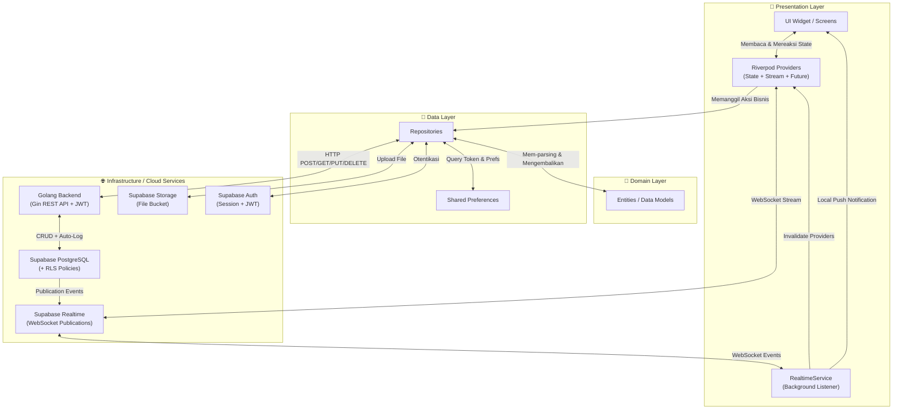
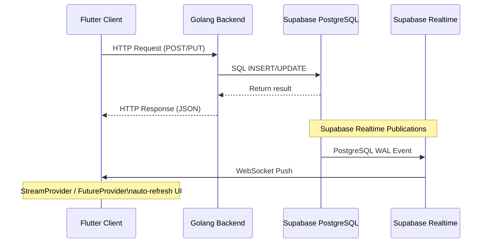

# 🚀 E-Ticketing Helpdesk & IT Support — Production-Ready Mobile Ticketing System

> **Tugas Ujian Akhir Semester (UAS) — Pemrograman Perangkat Bergerak**  
> **Oleh:** Arvi (DIV IT Universitas Airlangga)  
> **Arsitektur:** Clean Architecture (Feature-First Lite) + Real-Time Event-Driven  
> **Tech Stack:** Flutter | Riverpod | Supabase BaaS (Realtime + RLS) | Golang Backend  

---

## 📌 1. Project Identity

Aplikasi **E-Ticketing Helpdesk & IT Support** adalah platform manajemen pengaduan kendala teknis (insiden TI) berskala korporat yang dirancang khusus untuk memfasilitasi pelaporan cepat, penugasan teknisi yang cerdas, dan pemantauan siklus hidup insiden secara **transparan dan real-time**.

Aplikasi ini menggunakan perpaduan teknologi mutakhir yang saling melengkapi untuk mencapai kinerja tinggi, responsivitas antarmuka, keamanan data tingkat tinggi, dan **sinkronisasi data lintas perangkat secara instan**.

### 🛠️ Tech Stack yang Digunakan:

| Teknologi | Peran | Versi |
| :-------- | :---- | :---- |
| **Flutter** | Frontend Framework (Material 3, 60fps native rendering) | 3.x |
| **Riverpod** | State Management (StateNotifier, FutureProvider, StreamProvider) | 3.x |
| **Supabase** | BaaS — Auth, Storage, PostgreSQL, **Realtime Publications (WebSocket)**, **RLS** | 2.x |
| **Golang** | Backend REST API (Gin Framework, JWT Middleware, RBAC Handler) | 1.26 |
| **Shared Preferences** | Penyimpanan lokal (token, preferensi tema) | - |
| **Flutter Local Notifications** | Push notification lokal berbasis event Realtime | - |
| **url_launcher** | Pembuka lampiran PDF di viewer/browser eksternal | 6.x |

---

## 🏗️ 2. Arsitektur Sistem (Clean Architecture + Real-Time Event-Driven)

Aplikasi ini didesain menggunakan pendekatan **Clean Architecture dengan struktur folder Feature-First Lite**, yang telah **ditingkatkan** menjadi **Real-Time Event-Driven Architecture** melalui integrasi Supabase Realtime Publications.

### 📊 Diagram Alur Data Sistem



### Penjelasan Lapisan Arsitektur:
1.  **Presentation Layer (UI, State & Realtime):** Berisi berkas antarmuka pengguna dan pengelola status reaktif Riverpod. **Baru:** Dilengkapi `RealtimeService` yang berjalan di *background* untuk mendengarkan event perubahan data dari Supabase secara real-time.
2.  **Domain Layer (Entities & Enums):** Jantung aturan bisnis. Berisi `user_model.dart`, `ticket_model.dart` (termasuk `CommentModel` dan `TicketTimeline`). Terbebas dari ketergantungan framework.
3.  **Data Layer (Repositories & Services):** Menyatukan data lokal (SharedPreferences) dengan data jarak jauh (Golang API & Supabase SDK), mengubah format JSON mentah menjadi model objek bertipe aman.

---

## 👥 3. Role & Permissions (Matriks Hak Akses Dinamis)

Sistem menerapkan **Role-Based Access Control (RBAC)** berlapis — di sisi UI (Conditional Rendering), Backend (JWT Middleware + RoleGuard), dan Database (RLS Policy).

| Fitur Aplikasi | 👤 User (Pelapor) | 🛠️ Helpdesk (Staff) | 👑 Admin (Manager) |
| :--- | :---: | :---: | :---: |
| Mendaftar Akun Baru | ✅ | ❌ *(Di-bypass Admin)* | ❌ *(Manual DB)* |
| Mengirim Tiket & Lampiran (Gambar/PDF) | ✅ | ❌ | ❌ |
| Komentar & Live Chat Timeline | ✅ | ✅ | ✅ |
| Membaca Tiket Milik Sendiri | ✅ | ✅ | ✅ |
| Membaca Seluruh Tiket Sistem | ❌ | ❌ *(Hanya assigned)* | ✅ |
| Resolve Ticket *(In Progress → Resolved)* | ❌ | ✅ | ✅ |
| Assign Staff / Teknisi | ❌ | ❌ | ✅ |
| Menerima Notifikasi Komentar Real-Time | ✅ | ✅ *(RBAC filtered)* | ✅ |
| Pull-to-Refresh Manual | ✅ | ✅ | ✅ |
| Dashboard Statistik Global | ❌ | ❌ | ✅ |
| Manage Users (Aktif/Nonaktif) | ❌ | ❌ | ✅ |

---

## 📋 4. Daftar Fitur (Functional Requirements FR-001 s/d FR-017)

Aplikasi ini telah mengimplementasikan **17 spesifikasi fungsional** yang mencakup fitur dasar hingga real-time:

### Fitur Dasar (FR-001 s/d FR-011)
*   **🔑 FR-001 [Registrasi Akun]:** Mendaftarkan kredensial pengguna baru via Supabase Auth dan menyimpan data profil ke `public.profiles`.
*   **🔐 FR-002 [Login & Otentikasi]:** Proses masuk berbasis JWT dengan validasi role dinamis dari database.
*   **🔄 FR-003 [Auto-Restore Session]:** Cache Supabase Session untuk mempertahankan sesi aktif saat aplikasi ditutup/dibuka kembali.
*   **📝 FR-004 [Pembuatan Tiket]:** Formulir pengaduan terintegrasi, ID dihasilkan sebagai UUID v4 di sisi klien.
*   **📷 FR-005 [Lampiran Kamera/Galeri]:** Upload screenshot/foto ke Supabase Storage Bucket (maks. 5MB).
*   **🔍 FR-006 [Daftar Tiket & Filter]:** Daftar tiket interaktif dengan penyaringan status dan prioritas (`TicketFilter` provider).
*   **📄 FR-007 [Detail Tiket & Preview Attachment]:** Halaman detail komprehensif dengan data lampiran dari Supabase Cloud Bucket.
*   **📈 FR-008 [Statistik Bento Grid & Glassmorphic UI]:** Dashboard modern dengan layout *Bento Grid* dan efek *Glassmorphism*.
*   **🕒 FR-009 [Activity Timeline Stepper]:** Visualisasi garis waktu vertikal dengan *node* bulatan yang mencatat setiap peristiwa.
*   **⚙️ FR-010 [Resolve Ticket & Otorisasi]:** Tombol kontekstual "Resolve Ticket" yang muncul hanya pada status `in_progress`.
*   **🤖 FR-011 [Smart Assign Staff]:** Admin menugaskan teknisi dari daftar Helpdesk yang tersedia via dialog interaktif.

### Fitur Baru Pasca-Refactoring (FR-012 s/d FR-017)

*   **📎 FR-012 [Dukungan Lampiran Multi-Format]:**
    Sistem pembacaan file cerdas yang membedakan gambar (`.jpg`, `.png`, `.webp`) dan dokumen PDF (`.pdf`). File PDF ditampilkan sebagai Card interaktif Material 3 yang ketika ditekan akan membuka dokumen di browser/PDF viewer bawaan perangkat melalui modul `url_launcher`.

*   **🔔 FR-013 [Smart Push Notifications]:**
    Sistem notifikasi latar belakang (*background*) dari `realtime_service.dart` yang aktif merespons event `INSERT`/`UPDATE` pada tabel `tickets` dan `comments`. Dilengkapi:
    - **Anti-Spam:** Tidak membunyikan notifikasi untuk aksi yang dilakukan sendiri.
    - **RBAC Proteksi:** Notifikasi pada Helpdesk hanya masuk untuk tiket yang di-assign kepadanya.
    - **Konten Dinamis:** Judul dan isi notifikasi disesuaikan berdasarkan tipe event (komentar baru, status resolved, tiket baru, dll.)

*   **💬 FR-014 [Live Tracking & Real-Time Chat]:**
    Linear Timeline dan kolom komentar yang reaktif di bawah 1 detik tanpa perlu reload halaman. Menggunakan `StreamProvider` yang terhubung langsung ke Supabase Publications (WebSocket) untuk tabel `comments`, serta *listener* Realtime pada `ticketDetailProvider` untuk tabel `tickets` dan `ticket_histories`.

*   **🎭 FR-015 [Dynamic Role Masking]:**
    Penyamaran UUID staf menjadi teks baku (*"Ticket assigned to Helpdesk Technician"*) melalui fungsi `_cleanDescription()`. Pelabelan role dinamis pada timeline: *System Administrator*, *Technical Support*, *Reporter*.

*   **🔃 FR-016 [Pull-to-Refresh Fallback]:**
    Widget `RefreshIndicator` yang membungkus halaman detail tiket dengan `AlwaysScrollableScrollPhysics`. Berfungsi sebagai mekanisme cadangan jika koneksi WebSocket terputus, memungkinkan pengguna menarik layar ke bawah untuk memaksa sinkronisasi data.

*   **🌓 FR-017 [Tema Dark/Light Mode Persisten]:**
    Default tema `ThemeMode.light` saat instalasi pertama. Sakelar tema tersinkronisasi sempurna dalam sekali klik melalui `ThemeProvider` berbasis Riverpod + `SharedPreferences`.

---

## ⚡ 5. Technical Highlights (The 'Magic' Features)

### 🔮 A. Real-Time Event-Driven Architecture
Transisi dari arsitektur statis (request-response murni) menjadi **Event-Driven** menggunakan Supabase Realtime Publications:
```dart
// StreamProvider untuk komentar real-time
final ticketCommentsRealtimeProvider = StreamProvider.family<List<TicketTimeline>, String>((ref, ticketId) {
  return Supabase.instance.client
    .from('comments')
    .stream(primaryKey: ['id'])
    .eq('ticket_id', ticketId)
    .map((data) => data.map((json) => /* transform */ ).toList());
});

// Listener Realtime pada FutureProvider untuk auto-refresh status
final ticketDetailProvider = FutureProvider.family<TicketModel?, String>((ref, id) async {
  final channel = supabase.channel('ticket_detail_$id')
    .onPostgresChanges(event: PostgresChangeEvent.update, table: 'tickets',
      callback: (payload) { if (payload.newRecord['id'] == id) ref.invalidateSelf(); })
    .onPostgresChanges(event: PostgresChangeEvent.insert, table: 'ticket_histories',
      callback: (payload) { if (payload.newRecord['ticket_id'] == id) ref.invalidateSelf(); })
    .subscribe();
  ref.onDispose(() => channel.unsubscribe());
  // ... fetch data
});
```

### 🔮 B. Penggunaan UUID v4 untuk Integritas Data Tinggi
```dart
id: const Uuid().v4() // Digenerate instan di create_ticket_screen.dart
final String fileName = '${const Uuid().v4()}_${file.path.split('/').last}'; // File upload
```

### 🔮 C. SQL Trigger di Supabase untuk Bypass Verifikasi Email
```sql
CREATE OR REPLACE FUNCTION public.auto_verify_email()
RETURNS TRIGGER AS $$
BEGIN
    NEW.email_confirmed_at = NOW();
    RETURN NEW;
END;
$$ LANGUAGE plpgsql SECURITY DEFINER;

CREATE TRIGGER on_user_signup_verify
    BEFORE INSERT ON auth.users
    FOR EACH ROW
    EXECUTE FUNCTION public.auto_verify_email();
```

### 🔮 D. Row Level Security (RLS) pada Tabel `comments`
```sql
-- Policy: Enable read access for all users (SELECT)
-- Policy: Enable insert for authenticated users only (INSERT)
```

### 🔮 E. Conditional Visibility di Flutter untuk Keamanan UI
```dart
final user = ref.watch(authProvider).value;
final isUser = user?.role.toString().split('.').last == 'user';

// Tombol Resolve hanya muncul jika status = in_progress
if (ticket.status == TicketStatus.inProgress && !isUser) ...[
  ElevatedButton.icon(
    onPressed: () => _resolveTicket(ref, ticket.id),
    icon: const Icon(LucideIcons.checkCircle2),
    label: const Text('Resolve Ticket'),
  ),
]
```

---

## ⚙️ 6. Golang Backend API Service

### 6.1 Peran Backend

Backend Golang berfungsi sebagai **API Gateway terpusat** yang menangani validasi data, *business logic*, dan **auto-logging** perubahan status ke tabel `ticket_histories`. Backend ini berkomunikasi langsung dengan database Supabase PostgreSQL menggunakan library `supabase-go`.

### 6.2 Arsitektur File Backend

| File | Tanggung Jawab |
| :--- | :------------- |
| `main.go` | Entry point, konfigurasi Supabase client, routing endpoint (public + protected) |
| `handlers.go` | Implementasi seluruh handler CRUD: tickets, comments, histories, dashboard stats, users |
| `middleware.go` | JWT Auth Middleware (validasi token via Supabase Auth API) + RoleGuard middleware |
| `models.go` | Definisi struct: `Ticket`, `Comment`, `TicketHistory`, `DashboardStats`, `Profile` |

### 6.3 Daftar Endpoint REST API

#### Public Routes (Tanpa Autentikasi)

| Method | Endpoint | Fungsi |
| :----- | :------- | :----- |
| `GET` | `/ping` | Health check — return versi backend |
| `POST` | `/users/reset-password` | Bypass reset password via Supabase Admin API |

#### Protected Routes (Memerlukan JWT Bearer Token)

| Method | Endpoint | Guard | Fungsi |
| :----- | :------- | :---- | :----- |
| `GET` | `/tickets` | JWT | Ambil daftar tiket (**RBAC filtered** berdasarkan role) |
| `GET` | `/tickets/:id` | JWT | Ambil detail satu tiket |
| `POST` | `/tickets` | JWT | Buat tiket baru + auto-log ke `ticket_histories` |
| `PUT` | `/tickets/:id` | JWT | Update tiket + auto-log perubahan status & assignment |
| `DELETE` | `/tickets/:id` | JWT + `RoleGuard("admin")` | Hapus tiket (cascade delete comments & histories) |
| `GET` | `/tickets/:id/comments` | JWT | Ambil komentar tiket (diurutkan kronologis) |
| `POST` | `/tickets/:id/comments` | JWT | Tambah komentar + auto-log ke `ticket_histories` |
| `GET` | `/tickets/:id/histories` | JWT | Ambil riwayat aksi tiket (untuk fitur Tracking) |
| `GET` | `/dashboard/stats` | JWT | Statistik tiket (**RBAC filtered**: open, in_progress, resolved, total) |
| `GET` | `/users` | JWT + `RoleGuard("admin")` | Daftar semua pengguna |
| `GET` | `/users/helpdesk` | JWT + `RoleGuard("admin")` | Daftar pengguna role helpdesk (untuk dialog Assign Staff) |
| `PATCH` | `/users/:id/status` | JWT + `RoleGuard("admin")` | Toggle status aktif/nonaktif pengguna |

### 6.4 Mekanisme Auto-Logging (BR-005: Tracking)

Backend secara otomatis mencatat perubahan ke tabel `ticket_histories` tanpa intervensi klien:

| Aksi | Log yang Dicatat |
| :--- | :--------------- |
| Tiket baru dibuat | `"Ticket created with status 'open'"` |
| Status berubah | `"Status changed from 'open' to 'in_progress'"` |
| Tiket ditugaskan | `"Ticket assigned to '<staff_id>'"` |
| Komentar ditambahkan | `"Comment added by <user_name>"` |

### 6.5 Sinkronisasi Backend ↔ Supabase Realtime



Golang Backend **tidak perlu mengetahui** keberadaan Supabase Realtime. Backend hanya menulis data ke PostgreSQL melalui Supabase Client SDK, dan **Realtime Engine** secara independen mendeteksi perubahan dari PostgreSQL WAL (*Write-Ahead Log*) kemudian memancarkannya ke seluruh klien yang ter-*subscribe*.

---

## 📥 7. Instalasi & Cara Menjalankan

### 📋 Prasyarat
*   Flutter SDK (Minimal Versi 3.10.8)
*   Golang SDK (Minimal Versi 1.20) untuk Server Backend API
*   Akun aktif Supabase untuk BaaS
*   Tabel `comments`, `tickets`, dan `ticket_histories` dengan **Realtime Publications** diaktifkan di dashboard Supabase

### 🚀 Langkah Menjalankan Aplikasi

1.  **Clone dan Pindah ke Folder Project:**
    ```bash
    cd d:/Project/Android/maauts003
    ```
2.  **Unduh Seluruh Dependencies Flutter:**
    ```bash
    flutter pub get
    ```
3.  **Setup Environment Variables (.env):**
    Buat file bernama `.env` pada direktori root project dengan nilai variabel berikut:
    ```env
    SUPABASE_URL=https://chqperxbnbgsyeldptfk.supabase.co
    SUPABASE_ANON_KEY=YOUR_SUPABASE_ANON_KEY
    BACKEND_URL=http://10.0.2.2:8080 # IP khusus Emulator Android ke Localhost
    ```
4.  **Aktifkan Realtime Publications di Supabase:**
    Buka **Dashboard Supabase** → **Database** → **Replication** → pastikan toggle Realtime untuk tabel `comments`, `tickets`, dan `ticket_histories` sudah **ON**.
5.  **Jalankan Backend Golang:**
    ```bash
    cd d:/Project/helpdesk_backend
    go run .
    ```
6.  **Jalankan Aplikasi Mobile:**
    ```bash
    cd d:/Project/Android/maauts003
    flutter run
    ```
7.  **Build APK Release:**
    ```bash
    flutter clean && flutter pub get && flutter build apk --release
    ```
    Output: `build/app/outputs/flutter-apk/app-release.apk`
