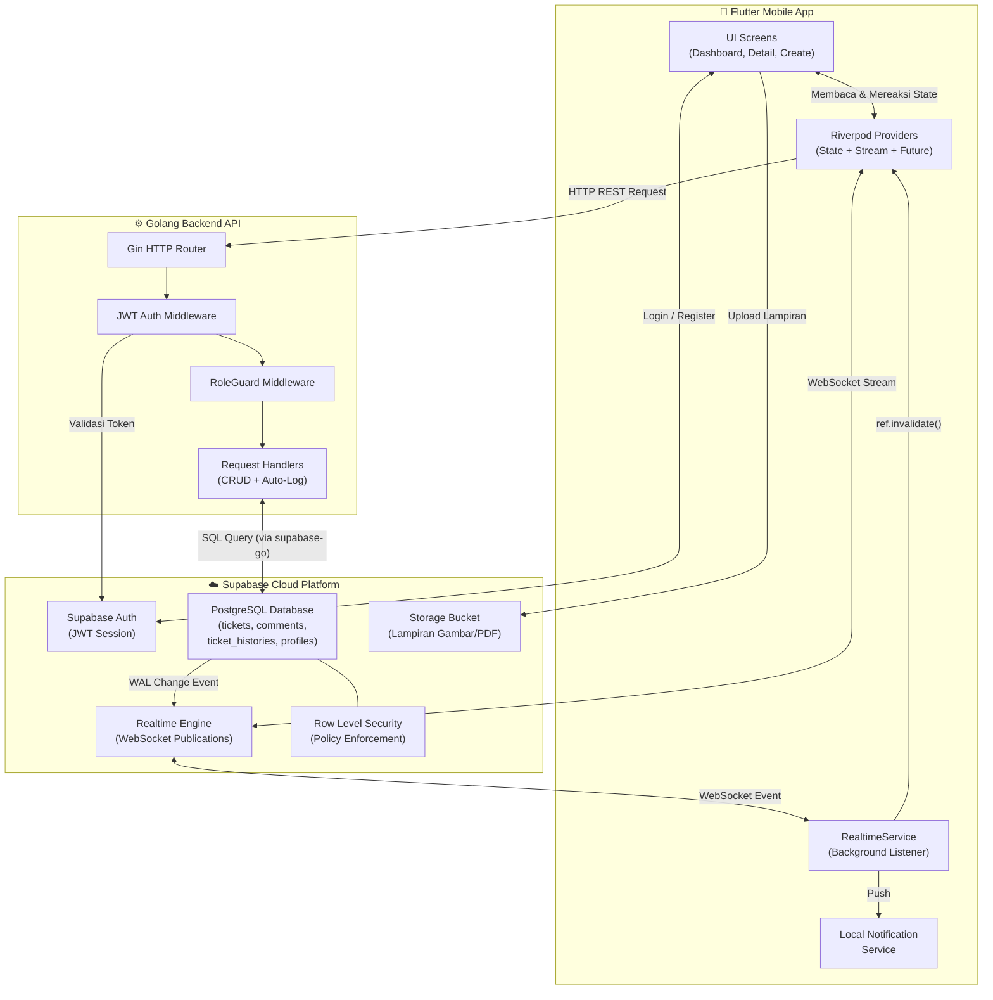
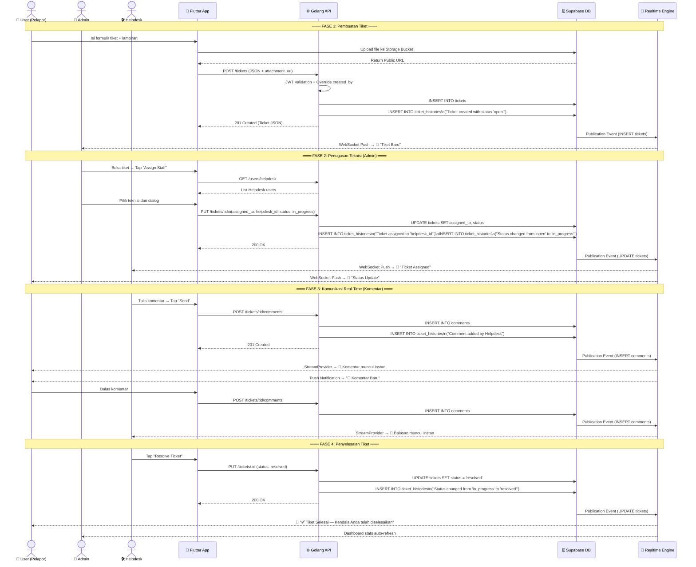
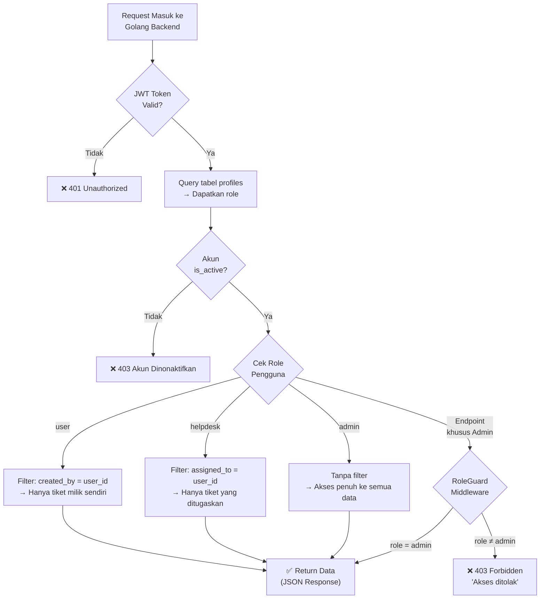
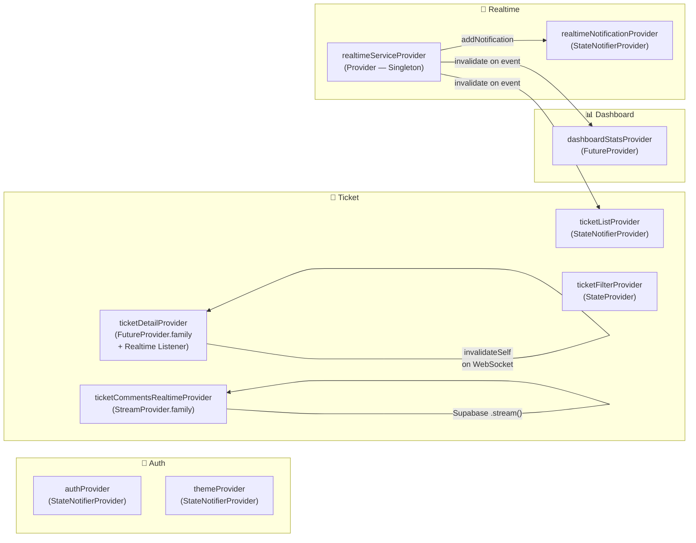
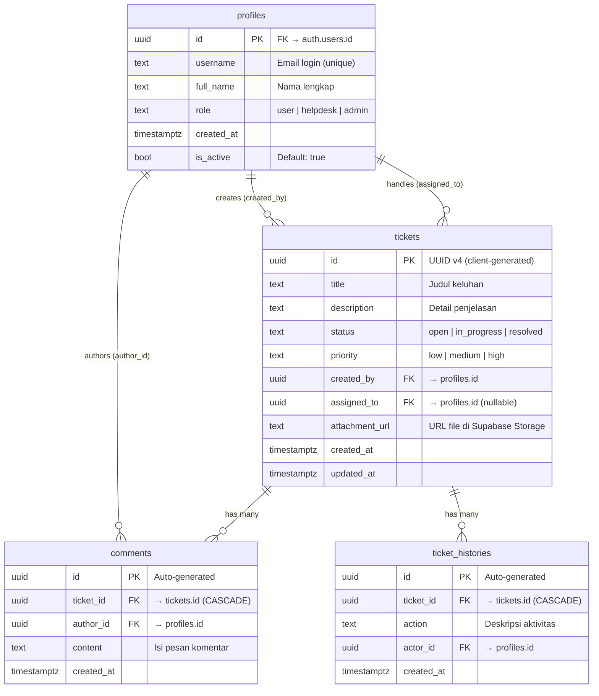
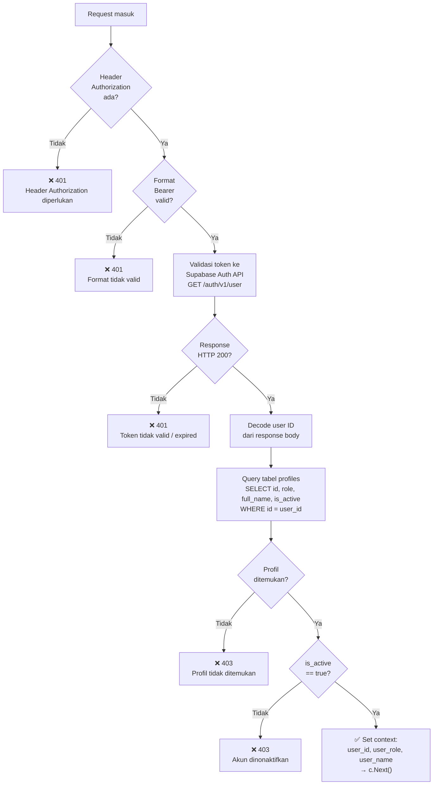
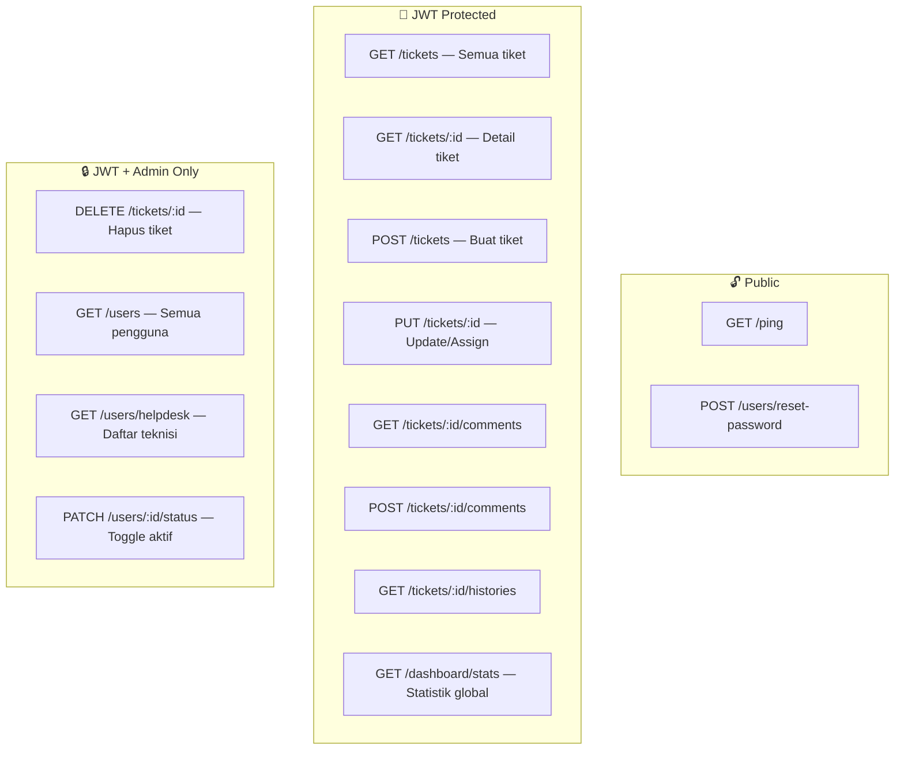
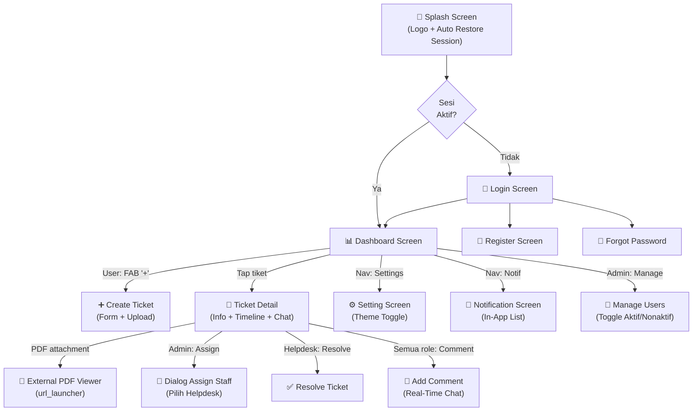
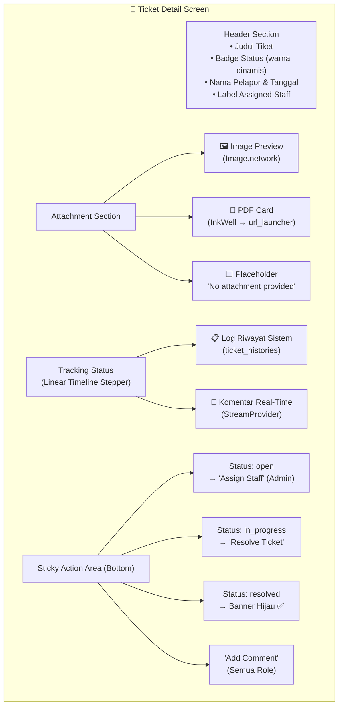

# Lampiran UAS Teori Praktikum — E-Ticketing Helpdesk & IT Support

> **Mata Kuliah:** Pemrograman Perangkat Bergerak  
> **Nama:** Arvi  
> **Program Studi:** DIV Teknologi Informasi — Universitas Airlangga  
> **Arsitektur:** Clean Architecture (Feature-First Lite) + Real-Time Event-Driven  
> **Tech Stack:** Flutter · Riverpod · Supabase (PostgreSQL + Realtime + RLS) · Golang (Gin)

---

## Daftar Isi

1. [Pendahuluan & Deskripsi Sistem](#1-pendahuluan--deskripsi-sistem)
2. [Flow Diagram Sistem](#2-flow-diagram-sistem)
3. [Arsitektur Aplikasi & State Management](#3-arsitektur-aplikasi--state-management)
4. [Desain Database (ERD & Skema Supabase)](#4-desain-database-erd--skema-supabase)
5. [Row Level Security (RLS) Policy](#5-row-level-security-rls-policy)
6. [Dokumentasi Backend API Golang (Perspektif Admin)](#6-dokumentasi-backend-api-golang-perspektif-admin)
7. [Desain UI/UX Aplikasi](#7-desain-uiux-aplikasi)
8. [Daftar Fitur Fungsional (FR)](#8-daftar-fitur-fungsional-fr)

---

## 1. Pendahuluan & Deskripsi Sistem

Aplikasi **E-Ticketing Helpdesk & IT Support** adalah platform manajemen pengaduan kendala teknis (insiden TI) berskala korporat. Sistem ini memfasilitasi tiga aktor utama:

| Aktor | Peran | Tanggung Jawab |
| :---- | :---- | :------------- |
| **User** (Pelapor) | Karyawan / Pengguna Akhir | Membuat tiket keluhan, mengunggah bukti lampiran (gambar/PDF), berkomunikasi via komentar |
| **Helpdesk** (Teknisi) | Staff IT Support | Menindaklanjuti tiket yang ditugaskan, berkomunikasi dengan pelapor, menyelesaikan insiden |
| **Admin** (Manager IT) | Pengawas Sistem | Melihat seluruh data, menugaskan teknisi, mengelola akun pengguna, memantau statistik operasional |

Seluruh komunikasi dan perubahan status berlangsung secara **real-time** melalui WebSocket (Supabase Realtime Publications), sehingga setiap aktor mendapatkan pembaruan data secara instan tanpa perlu melakukan *refresh* manual.

---

## 2. Flow Diagram Sistem

### 2.1 Diagram Alur Data Keseluruhan (System Architecture)



### 2.2 Sequence Diagram — Alur Lengkap Pembuatan Tiket Hingga Resolusi



### 2.3 Flowchart Logika RBAC (Role-Based Access Control)



---

## 3. Arsitektur Aplikasi & State Management

### 3.1 Clean Architecture — Feature-First Lite

```
lib/
├── core/
│   ├── network/          → Dio HTTP Client + Interceptor
│   ├── services/         → RealtimeService, LocalNotificationService
│   └── theme/            → ThemeProvider (Dark/Light Mode)
│
├── features/
│   ├── auth/
│   │   ├── data/         → AuthRepository (Supabase Auth SDK)
│   │   ├── domain/       → UserModel, UserRole enum
│   │   └── presentation/ → LoginScreen, RegisterScreen, AuthProvider
│   │
│   ├── ticket/
│   │   ├── data/         → TicketRepository (Dio → Golang API)
│   │   ├── domain/       → TicketModel, CommentModel, TicketTimeline
│   │   └── presentation/
│   │       ├── providers/ → ticket_provider.dart (5 providers)
│   │       ├── screens/   → create, detail, list, tracking
│   │       └── widgets/   → timeline_stepper.dart
│   │
│   ├── dashboard/
│   │   ├── data/         → UserRepository (Admin: manage users)
│   │   └── presentation/ → DashboardScreen (role-adaptive Bento Grid)
│   │
│   └── notification/
│       └── presentation/ → NotificationScreen, in-app notif list
│
└── main.dart             → App entry point + RealtimeService.start()
```

### 3.2 State Management — Riverpod Provider Map



### 3.3 Transisi Arsitektur: Statis → Real-Time

| Aspek | Sebelum (v1.0 — Statis) | Sesudah (v3.0 — Real-Time) |
| :---- | :---------------------- | :------------------------- |
| Komentar | `FutureProvider` — harus refresh manual | `StreamProvider` — Supabase `.stream()` WebSocket |
| Status tiket | Tidak berubah tanpa navigasi ulang | `FutureProvider` + Realtime Listener → `ref.invalidateSelf()` |
| Riwayat (histories) | Hanya dimuat saat halaman dibuka | Realtime Listener `INSERT` pada `ticket_histories` |
| Notifikasi | Tidak ada | `RealtimeService` background → Local Push Notification |
| Fallback | Tidak ada | `RefreshIndicator` (Pull-to-Refresh) |

---

## 4. Desain Database (ERD & Skema Supabase)

### 4.1 Entity Relationship Diagram (ERD)



### 4.2 Skema Tabel Detail

#### Tabel `profiles` (Data Pengguna Aplikasi)

| Kolom | Tipe | Nullable | Keterangan |
| :---- | :--- | :------- | :--------- |
| `id` | `uuid` (PK) | ✖ Non-Nullable | Foreign Key dari `auth.users.id` (Supabase Auth) |
| `username` | `text` | ◯ Nullable | Email login pengguna |
| `full_name` | `text` | ◯ Nullable | Nama lengkap untuk ditampilkan di UI |
| `role` | `text` | ◯ Nullable | Peran aplikasi: `user`, `helpdesk`, atau `admin` |
| `created_at` | `timestamptz` | ◯ Nullable | Waktu akun dibuat |
| `is_active` | `bool` | ◯ Nullable | Status aktif akun (Default: `true`). Admin dapat menonaktifkan |

#### Tabel `tickets` (Data Utama Tiket Pengaduan)

| Kolom | Tipe | Nullable | Keterangan |
| :---- | :--- | :------- | :--------- |
| `id` | `uuid` (PK) | ✖ Non-Nullable | UUID v4 di-generate oleh Flutter client sebelum dikirim |
| `title` | `text` | ◯ Nullable | Judul keluhan atau masalah |
| `description` | `text` | ◯ Nullable | Detail penjelasan kendala teknis |
| `status` | `text` | ◯ Nullable | Status siklus hidup: `open` → `in_progress` → `resolved` |
| `priority` | `text` | ◯ Nullable | Prioritas penanganan: `low`, `medium`, `high` |
| `created_by` | `uuid` (FK) | ◯ Nullable | ID pelapor → `profiles.id` |
| `assigned_to` | `uuid` (FK) | ◯ Nullable | ID teknisi yang ditugaskan → `profiles.id` |
| `attachment_url` | `text` | ◯ Nullable | URL file lampiran di Supabase Storage (gambar atau PDF) |
| `created_at` | `timestamptz` | ◯ Nullable | Waktu tiket dibuat |
| `updated_at` | `timestamptz` | ◯ Nullable | Waktu terakhir tiket diperbarui |

#### Tabel `comments` (Percakapan pada Tiket)

| Kolom | Tipe | Nullable | Keterangan |
| :---- | :--- | :------- | :--------- |
| `id` | `uuid` (PK) | ✖ Non-Nullable | Auto-generated oleh PostgreSQL |
| `ticket_id` | `uuid` (FK) | ◯ Nullable | Relasi ke `tickets.id` — ON DELETE CASCADE |
| `author_id` | `uuid` (FK) | ◯ Nullable | Relasi ke `profiles.id` — pengirim komentar |
| `content` | `text` | ◯ Nullable | Isi pesan komentar asli yang diketik pengguna |
| `created_at` | `timestamptz` | ◯ Nullable | Waktu komentar dikirim |

#### Tabel `ticket_histories` (Audit Trail / Log Aktivitas)

| Kolom | Tipe | Nullable | Keterangan |
| :---- | :--- | :------- | :--------- |
| `id` | `uuid` (PK) | ✖ Non-Nullable | Auto-generated oleh PostgreSQL |
| `ticket_id` | `uuid` (FK) | ◯ Nullable | Relasi ke `tickets.id` — ON DELETE CASCADE |
| `action` | `text` | ◯ Nullable | Deskripsi aktivitas (misal: "Status changed from 'open' to 'in_progress'") |
| `actor_id` | `uuid` (FK) | ◯ Nullable | ID pelaku aksi → `profiles.id` |
| `created_at` | `timestamptz` | ◯ Nullable | Waktu aktivitas tercatat |

### 4.3 Relasi Antar-Tabel

| Relasi | Kardinalitas | Constraint |
| :----- | :----------- | :--------- |
| `profiles` → `tickets` (via `created_by`) | One-to-Many | Satu user dapat membuat banyak tiket |
| `profiles` → `tickets` (via `assigned_to`) | One-to-Many | Satu helpdesk dapat menangani banyak tiket |
| `tickets` → `comments` (via `ticket_id`) | One-to-Many | Satu tiket memiliki banyak komentar — **ON DELETE CASCADE** |
| `tickets` → `ticket_histories` (via `ticket_id`) | One-to-Many | Satu tiket memiliki banyak log riwayat — **ON DELETE CASCADE** |
| `profiles` → `comments` (via `author_id`) | One-to-Many | Satu user dapat menulis banyak komentar |

### 4.4 Supabase Realtime Publications

Ketiga tabel operasional berikut telah diaktifkan fitur **Realtime Publications** pada dashboard Supabase (**Database → Replication → Tables**):

| Tabel | Status Realtime | Fungsi |
| :---- | :-------------- | :----- |
| `tickets` | ✅ **ON** | Memicu notifikasi dan pembaruan daftar tiket saat INSERT/UPDATE/DELETE |
| `comments` | ✅ **ON** | Memicu pembaruan timeline komentar secara instan (StreamProvider) |
| `ticket_histories` | ✅ **ON** | Memicu pembaruan log riwayat pada halaman detail tiket |

---

## 5. Row Level Security (RLS) Policy

Supabase PostgreSQL dilindungi oleh **Row Level Security (RLS)** yang membatasi akses data langsung pada level baris tabel.

### 5.1 Kebijakan RLS pada Tabel `comments`

| Nama Policy | Operasi | Applied To | Deskripsi |
| :---------- | :------ | :--------- | :-------- |
| `Enable insert for authenticated users only` | **INSERT** | `authenticated` | Hanya pengguna yang telah login dapat menambahkan komentar baru |
| `Enable read access for all users` | **SELECT** | `public` | Semua pengguna (termasuk yang belum login) dapat membaca komentar |

### 5.2 Kebijakan RLS pada Tabel `profiles`

| Nama Policy | Operasi | Applied To | Deskripsi |
| :---------- | :------ | :--------- | :-------- |
| `Allow authenticated users to read profiles` | **SELECT** | `authenticated` | Pengguna yang telah login dapat membaca data profil (untuk resolusi nama pada UI) |

### 5.3 Kebijakan RLS pada Tabel `ticket_histories`

RLS diaktifkan namun kebijakan spesifik dikontrol melalui **JWT Auth Middleware** di Golang Backend — data histories hanya dapat diakses melalui endpoint terproteksi `GET /tickets/:id/histories`.

---

## 6. Dokumentasi Backend API Golang (Perspektif Admin)

### 6.1 Gambaran Umum Backend

Backend Golang berfungsi sebagai **API Gateway terpusat** yang menangani:
- Validasi payload JSON dan otorisasi JWT
- Business logic RBAC (Role-Based Access Control)
- Auto-logging perubahan ke tabel `ticket_histories`
- Komunikasi dengan database Supabase PostgreSQL via library `supabase-go`

**Dependensi utama:**

| Library | Fungsi |
| :------ | :----- |
| `github.com/gin-gonic/gin` v1.12 | HTTP web framework berkecepatan tinggi |
| `github.com/supabase-community/supabase-go` v0.0.4 | SDK client untuk query Supabase PostgreSQL |
| `github.com/joho/godotenv` v1.5.1 | Loader environment variables dari file `.env` |

### 6.2 Arsitektur File Backend

```
helpdesk_backend/
├── main.go          → Entry point, konfigurasi, routing
├── handlers.go      → Implementasi seluruh handler CRUD
├── middleware.go     → JWT Auth + RoleGuard middleware
├── models.go        → Struct definisi: Ticket, Comment, TicketHistory, Profile
├── go.mod           → Module dependencies
└── .env             → Environment variables (SUPABASE_URL, KEY, JWT_SECRET)
```

### 6.3 Struct Data Model (models.go)

```go
// Ticket — merepresentasikan tabel public.tickets
type Ticket struct {
    ID            string `json:"id"`
    Title         string `json:"title"`
    Description   string `json:"description"`
    Status        string `json:"status"`
    Priority      string `json:"priority,omitempty"`
    CreatedBy     string `json:"created_by"`
    AssignedTo    string `json:"assigned_to,omitempty"`
    AttachmentURL string `json:"attachment_url,omitempty"`
    CreatedAt     string `json:"created_at,omitempty"`
    UpdatedAt     string `json:"updated_at,omitempty"`
}

// Comment — merepresentasikan tabel public.comments
type Comment struct {
    ID        string `json:"id"`
    TicketID  string `json:"ticket_id"`
    AuthorID  string `json:"author_id"`
    Content   string `json:"content"`
    CreatedAt string `json:"created_at,omitempty"`
}

// TicketHistory — merepresentasikan tabel public.ticket_histories
type TicketHistory struct {
    ID        string `json:"id"`
    TicketID  string `json:"ticket_id"`
    Action    string `json:"action"`
    ActorID   string `json:"actor_id"`
    CreatedAt string `json:"created_at,omitempty"`
}

// DashboardStats — response statistik tiket
type DashboardStats struct {
    Open       int `json:"open"`
    InProgress int `json:"in_progress"`
    Resolved   int `json:"resolved"`
    Total      int `json:"total"`
}

// Profile — merepresentasikan tabel public.profiles
type Profile struct {
    ID       string `json:"id"`
    Username string `json:"username"`
    FullName string `json:"full_name"`
    Role     string `json:"role"`
    IsActive bool   `json:"is_active"`
}
```

### 6.4 Middleware (middleware.go)

#### A. JWT Auth Middleware — `JWTAuthMiddleware()`

Middleware ini berjalan pada **setiap request** ke endpoint terproteksi:



**Data yang disimpan ke Gin Context:**
```go
c.Set("user_id", userID)       // UUID pengguna
c.Set("user_role", profile.Role) // "user" | "helpdesk" | "admin"
c.Set("user_name", profile.FullName) // Nama untuk logging
```

#### B. RoleGuard Middleware — `RoleGuard()`

Middleware tambahan yang dipasang **setelah** JWT Auth untuk endpoint khusus Admin:

```go
// Penggunaan di routing:
auth.DELETE("/tickets/:id", RoleGuard("admin"), DeleteTicket(client))
auth.GET("/users", RoleGuard("admin"), GetAllUsers(client))
auth.GET("/users/helpdesk", RoleGuard("admin"), GetHelpdeskUsers(client))
auth.PATCH("/users/:id/status", RoleGuard("admin"), ToggleUserStatus(client))
```

Jika role pengguna **bukan** salah satu dari `allowedRoles`, middleware mengembalikan:
```json
{
  "error": "Akses ditolak: role 'user' tidak memiliki izin untuk endpoint ini"
}
```

### 6.5 Daftar Lengkap Endpoint API (Khusus Perspektif Admin)

> Berikut adalah seluruh endpoint yang dapat diakses oleh role **Admin**, beserta penjelasan lengkap request/response dan logika bisnis di dalamnya.

---

#### 📍 `GET /ping` — Health Check (Public)

**Deskripsi:** Mengecek status backend.

**Response:**
```json
{
  "message": "Backend Helpdesk v2.0.0 Ready!",
  "version": "2.0.0"
}
```

---

#### 📍 `GET /tickets` — Ambil Daftar Seluruh Tiket

**Guard:** JWT Auth  
**Perilaku untuk Admin:** Mengembalikan **seluruh tiket** dari semua pengguna tanpa filter.

**Logika RBAC di Backend:**
```go
switch roleLower {
case "user":
    query = query.Eq("created_by", userID)      // Filter milik sendiri
case "helpdesk":
    query = query.Eq("assigned_to", userID)     // Filter yang di-assign
case "admin":
    // TANPA FILTER — Admin melihat semua
}
```

**Response:** `200 OK` — Array of Ticket objects, diurutkan `created_at` descending.
```json
[
  {
    "id": "a1b2c3d4-...",
    "title": "Wifi Ruang Rapat Mati",
    "description": "Wifi di lantai 3 tidak bisa connect sejak pagi.",
    "status": "open",
    "priority": "high",
    "created_by": "user-uuid-123",
    "assigned_to": "",
    "attachment_url": "https://...supabase.co/storage/v1/object/public/attachments/foto.jpg",
    "created_at": "2026-07-04T10:30:00Z"
  }
]
```

---

#### 📍 `GET /tickets/:id` — Ambil Detail Satu Tiket

**Guard:** JWT Auth

**Response:** `200 OK` — Single Ticket object.

**Error:** `404 Not Found` jika ID tidak ditemukan.

---

#### 📍 `POST /tickets` — Buat Tiket Baru

**Guard:** JWT Auth  
**Catatan:** Endpoint ini biasanya dipanggil oleh role **User**, namun Admin secara teknis juga dapat mengaksesnya.

**Request Body:**
```json
{
  "id": "uuid-v4-dari-client",
  "title": "Printer Lantai 2 Error",
  "description": "Printer HP LaserJet mengeluarkan kertas kosong.",
  "priority": "medium",
  "attachment_url": "https://...supabase.co/.../foto_error.jpg"
}
```

**Logika Backend:**
1. Override `created_by` dari JWT token (mencegah spoofing user ID)
2. Default `status` = `"open"` jika kosong
3. INSERT ke tabel `tickets`
4. **Auto-Log:** INSERT ke `ticket_histories` → `"Ticket created with status 'open'"`

**Response:** `201 Created` — Ticket object yang baru dibuat.

---

#### 📍 `PUT /tickets/:id` — Update Tiket (Assign Staff / Ubah Status)

**Guard:** JWT Auth  
**Penggunaan Admin:** Endpoint ini adalah yang paling sering digunakan Admin untuk:
- **Menugaskan teknisi** → mengirim `assigned_to` + `status: "in_progress"`
- **Mengubah status** → mengirim `status: "resolved"`

**Request Body (Contoh: Assign Staff):**
```json
{
  "assigned_to": "helpdesk-uuid-456",
  "status": "in_progress"
}
```

**Logika Backend (Auto-Logging):**
```go
// 1. Ambil data tiket SAAT INI untuk deteksi perubahan
var currentTicket Ticket
// ... query tiket lama ...

oldStatus := currentTicket.Status
oldAssignee := currentTicket.AssignedTo

// 2. Lakukan UPDATE
// ... update ke database ...

// 3. AUTO-LOG: Jika status berubah
if newStatus != oldStatus {
    history := map[string]interface{}{
        "ticket_id": id,
        "action":    fmt.Sprintf("Status changed from '%s' to '%s'", oldStatus, newStatus),
        "actor_id":  userID,
    }
    client.From("ticket_histories").Insert(history, ...)
}

// 4. AUTO-LOG: Jika assigned_to berubah
if newAssignee != oldAssignee {
    history := map[string]interface{}{
        "ticket_id": id,
        "action":    fmt.Sprintf("Ticket assigned to '%s'", newAssignee),
        "actor_id":  userID,
    }
    client.From("ticket_histories").Insert(history, ...)
}
```

**Response:** `200 OK` — Updated Ticket object.

---

#### 📍 `DELETE /tickets/:id` — Hapus Tiket (Admin Only)

**Guard:** JWT Auth + `RoleGuard("admin")`  
**Catatan:** Hanya Admin yang dapat menghapus tiket. Cascade delete akan otomatis menghapus `comments` dan `ticket_histories` terkait.

**Logika:**
1. Verifikasi tiket ada di database
2. Hapus tiket (`ON DELETE CASCADE` akan membersihkan data terkait)

**Response:**
```json
{
  "message": "Tiket berhasil dihapus",
  "id": "a1b2c3d4-..."
}
```

---

#### 📍 `GET /tickets/:id/comments` — Ambil Komentar Tiket

**Guard:** JWT Auth

**Response:** `200 OK` — Array of Comment objects, diurutkan `created_at` ascending (kronologis).
```json
[
  {
    "id": "comment-uuid-1",
    "ticket_id": "ticket-uuid-abc",
    "author_id": "user-uuid-123",
    "content": "Sudah dicoba restart router-nya, pak?",
    "created_at": "2026-07-04T11:00:00Z"
  }
]
```

---

#### 📍 `POST /tickets/:id/comments` — Tambah Komentar

**Guard:** JWT Auth

**Request Body:**
```json
{
  "content": "Sudah saya cek, router perlu diganti."
}
```

**Logika Backend:**
1. Verifikasi tiket ada
2. INSERT ke tabel `comments` (`ticket_id`, `author_id` dari JWT, `content`)
3. **Auto-Log:** INSERT ke `ticket_histories` → `"Comment added by <user_name>"`

**Response:** `201 Created` — Comment object.

---

#### 📍 `GET /tickets/:id/histories` — Ambil Riwayat Aksi Tiket

**Guard:** JWT Auth

**Response:** `200 OK` — Array of TicketHistory objects, diurutkan kronologis.
```json
[
  {
    "id": "history-uuid-1",
    "ticket_id": "ticket-uuid-abc",
    "action": "Ticket created with status 'open'",
    "actor_id": "user-uuid-123",
    "created_at": "2026-07-04T10:30:00Z"
  },
  {
    "id": "history-uuid-2",
    "ticket_id": "ticket-uuid-abc",
    "action": "Ticket assigned to 'helpdesk-uuid-456'",
    "actor_id": "admin-uuid-789",
    "created_at": "2026-07-04T10:45:00Z"
  },
  {
    "id": "history-uuid-3",
    "ticket_id": "ticket-uuid-abc",
    "action": "Status changed from 'open' to 'in_progress'",
    "actor_id": "admin-uuid-789",
    "created_at": "2026-07-04T10:45:01Z"
  }
]
```

---

#### 📍 `GET /dashboard/stats` — Statistik Dashboard

**Guard:** JWT Auth  
**Perilaku Admin:** Mengembalikan statistik dari **seluruh tiket** di sistem tanpa filter.

**Response:**
```json
{
  "open": 5,
  "in_progress": 3,
  "resolved": 12,
  "total": 20
}
```

---

#### 📍 `GET /users` — Ambil Daftar Seluruh Pengguna (Admin Only)

**Guard:** JWT Auth + `RoleGuard("admin")`

**Response:** `200 OK` — Array of Profile objects, diurutkan `full_name` ascending.
```json
[
  {
    "id": "uuid-1",
    "username": "admin@unair.ac.id",
    "full_name": "Admin Manager",
    "role": "admin",
    "is_active": true
  },
  {
    "id": "uuid-2",
    "username": "budi@unair.ac.id",
    "full_name": "Budi Santoso",
    "role": "user",
    "is_active": true
  }
]
```

---

#### 📍 `GET /users/helpdesk` — Ambil Daftar Teknisi Helpdesk (Admin Only)

**Guard:** JWT Auth + `RoleGuard("admin")`  
**Penggunaan:** Digunakan saat Admin membuka dialog **"Assign Staff"** — menampilkan hanya pengguna dengan role `helpdesk`.

**Response:** `200 OK` — Array of Profile objects (filtered `role = 'helpdesk'`).

---

#### 📍 `PATCH /users/:id/status` — Toggle Status Aktif/Nonaktif Pengguna (Admin Only)

**Guard:** JWT Auth + `RoleGuard("admin")`

**Request Body:**
```json
{
  "is_active": false
}
```

**Response:** `200 OK` — Updated Profile object.

**Efek:** Jika `is_active` diset `false`, pengguna yang bersangkutan tidak akan bisa login karena JWT Auth Middleware akan menolak request mereka dengan pesan **"Akun Anda telah dinonaktifkan oleh Admin"**.

---

#### 📍 `POST /users/reset-password` — Reset Password (Public)

**Deskripsi:** Endpoint publik untuk melakukan bypass reset password melalui Supabase Admin API.

**Request Body:**
```json
{
  "email": "budi@unair.ac.id",
  "new_password": "passwordBaru123"
}
```

**Logika:**
1. Cari user di tabel `profiles` berdasarkan `username` (email)
2. Kirim request PUT ke `SUPABASE_URL/auth/v1/admin/users/{user_id}` menggunakan **Service Role Key**
3. Update password di Supabase Auth

**Response:** `200 OK`
```json
{
  "message": "Password berhasil di-reset"
}
```

---

### 6.6 Diagram Ringkasan Endpoint Admin



---

## 7. Desain UI/UX Aplikasi

### 7.1 Prinsip Desain

| Prinsip | Implementasi |
| :------ | :----------- |
| **Material Design 3** | Pedoman warna, tipografi, dan komponen dari Google M3 |
| **Glassmorphism** | Efek kaca buram translusen pada Card dan Header (BackdropFilter) |
| **Bento Grid** | Layout dashboard asimetris responsif untuk penyajian statistik |
| **Dark/Light Mode** | Default Light Mode; sinkronisasi tema persisten via SharedPreferences |
| **Lucide Icons** | Ikon bersudut lengkung yang elegan menggantikan Material Icons klasik |

### 7.2 Screen Flow (Navigasi Halaman)



### 7.3 Dashboard Adaptif Berdasarkan Role

| Role | Komponen Dashboard |
| :--- | :----------------- |
| **User** | Banner besar "Create New Ticket" + daftar tiket pribadi + statistik personal |
| **Helpdesk** | Bento Grid "Assigned to Me" + list tiket high-priority yang butuh penanganan |
| **Admin** | Bento Grid statistik global (Open/InProgress/Resolved/Total) + shortcut "Manage Users" + semua tiket |

### 7.4 Halaman Detail Tiket — Komponen UI



### 7.5 Sistem Notifikasi Real-Time

| Event | Judul Notifikasi | Isi Pesan |
| :---- | :--------------- | :-------- |
| Tiket baru dibuat | 🆕 Tiket Baru | Tiket "{title}" telah dibuat |
| Status → resolved | ✅ Tiket Selesai | Kendala Anda telah berhasil diselesaikan oleh teknisi. |
| Status berubah | 🔄 Status Update | "{title}" berubah menjadi {status} |
| Tiket di-assign | 👤 Ticket Assigned | "{title}" telah di-assign ke staff baru |
| Komentar baru | 💬 Komentar Baru pada Tiket #XXXXXXXX | {nama_pengirim}: {isi_komentar} |
| Tiket dihapus | 🗑️ Tiket Dihapus | Sebuah tiket telah dihapus oleh admin |

---

## 8. Daftar Fitur Fungsional (FR)

| Kode | Fitur | Deskripsi |
| :--- | :---- | :-------- |
| FR-001 | Registrasi Akun | Pendaftaran user baru via Supabase Auth + auto-insert ke `profiles` |
| FR-002 | Login & Otentikasi | Login berbasis JWT dengan validasi role dinamis |
| FR-003 | Auto-Restore Session | Cache sesi untuk mempertahankan login aktif |
| FR-004 | Pembuatan Tiket | Formulir pengaduan + UUID v4 client-generated |
| FR-005 | Lampiran Kamera/Galeri | Upload bukti foto ke Supabase Storage Bucket |
| FR-006 | Daftar Tiket & Filter | List interaktif + filter status + filter prioritas |
| FR-007 | Detail Tiket & Preview | Halaman detail + preview lampiran (gambar/PDF) |
| FR-008 | Dashboard Bento Grid | Statistik visual + Glassmorphism + role-adaptive |
| FR-009 | Activity Timeline | Visualisasi stepper vertikal untuk riwayat tiket |
| FR-010 | Resolve Ticket | Tombol kontekstual berdasarkan status tiket |
| FR-011 | Smart Assign Staff | Admin menugaskan teknisi dari dialog Helpdesk |
| FR-012 | Lampiran Multi-Format | Deteksi otomatis gambar vs PDF + `url_launcher` |
| FR-013 | Smart Push Notifications | Notifikasi real-time + Anti-Spam + RBAC filter |
| FR-014 | Live Tracking & Chat | Komentar real-time < 1 detik via StreamProvider |
| FR-015 | Dynamic Role Masking | Penyamaran UUID + label role dinamis pada timeline |
| FR-016 | Pull-to-Refresh | RefreshIndicator sebagai fallback koneksi |
| FR-017 | Dark/Light Mode | Tema persisten + default Light Mode |

---

> *Dokumen ini disusun sebagai lampiran laporan UAS Teori Praktikum Pemrograman Perangkat Bergerak. Seluruh diagram dan penjelasan mencerminkan kondisi kode sumber paling mutakhir per tanggal Juli 2026.*
